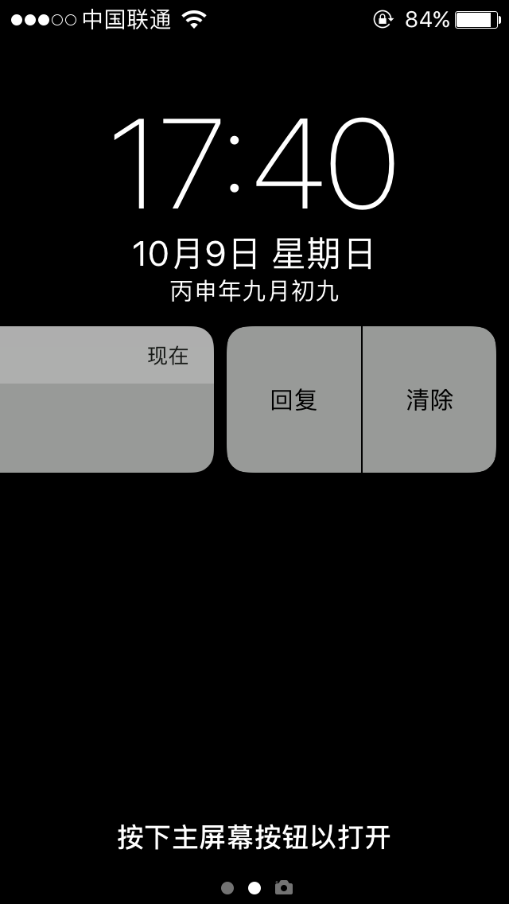
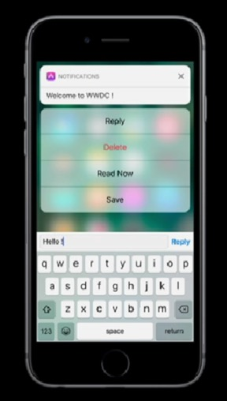
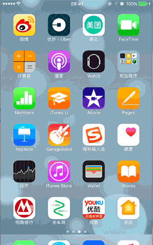
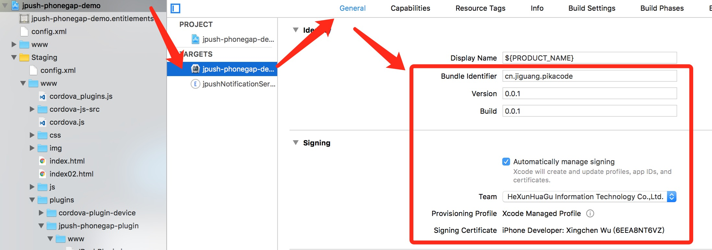
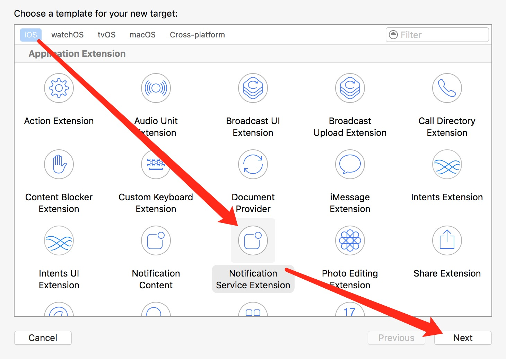
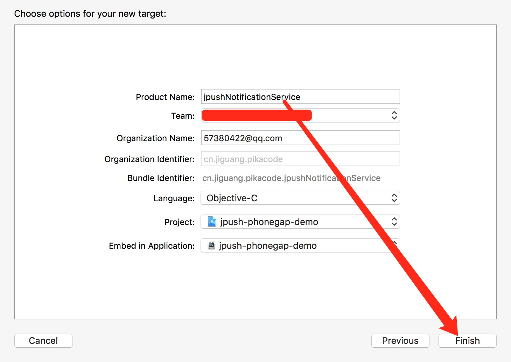
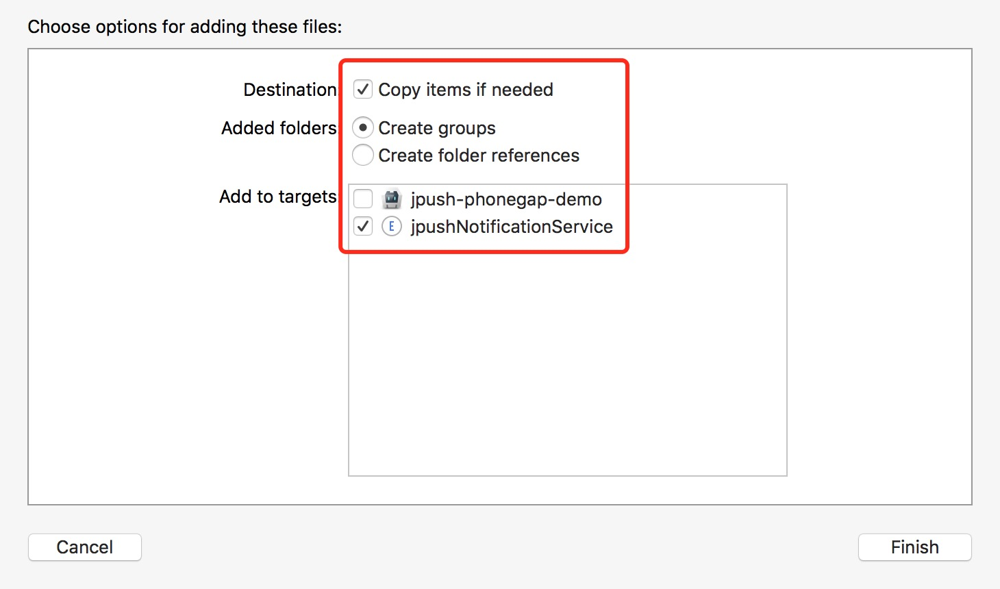
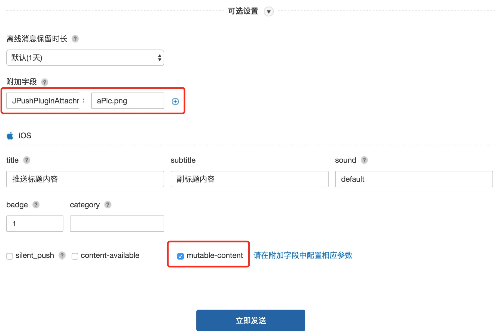

# iOS API

- [延迟注册和启动推送通知服务](#延迟注册和启动推送通知服务)
- [开始与停止推送服务](#开始与停止推送服务)
- [获取 RegistrationID](#获取-registrationid)
- [获取 APNS 推送内容](#获取-apns-推送内容)
  - [点击推送通知](#点击推送通知)
  - [前台收到推送](#前台收到推送)
  - [后台收到推送](#后台收到推送)
- [获取自定义消息内容](#获取自定义消息内容)
- [设置Badge](#设置badge)
- [本地通知](#本地通知)
- [获取本地通知内容](#获取本地通知内容)
- [页面的统计](#页面的统计)
- [日志等级设置](#日志等级设置)
- [地理位置上报](#地理位置上报)
- [设备平台判断](#设备平台判断)
- [iOS 10 进阶推送特性](#ios-10-进阶推送特性)
- [获取用户推送设置](#获取用户推送设置)
- [监听事件统一说明](#监听事件统一说明)

## 延迟注册和启动推送通知服务

本插件默认在 App 启动完成之后，立即「注册苹果通知服务」+「启动 JPush SDK」，其中：

- 「注册苹果通知服务」会弹出提示窗口向用户请求权限。
- 「启动 JPush SDK」是使用 JPush 各项 API 的必要条件。

开发者可以根据自己的需求，延迟注册和启动，需做以下操作：

1.查找并配置 `PushConfig.plist` 文件中的 `Delay` 字段为 `YES`，表明会延迟使用，此时插件不再自动注册、启动通知。
2.在需要注册并启动通知的地方调用 API - `startJPushSDK`。

### API - startJPushSDK

注册苹果通知服务，并启动 JPush SDK。

#### 接口定义

```js
window.JPush.startJPushSDK()
```

## 开始与停止推送服务

### API - init

调用此 API，用来开启 JPush SDK 提供的推送服务。

#### 接口定义

```js
window.JPush.init()
```

### API - stopPush

开发者 App 可以通过调用停止推送服务 API 来停止极光推送服务，当又需要使用极光推送服务时，则必须要调用恢复推送服务 API。

本功能是一个完全本地的状态操作。也就是说：停止推送服务的状态不会保存到服务器上。
如果停止推送服务后，开发者 App 被重新安装，或者被清除数据，
JPush SDK 会恢复正常的默认行为。（因为保存在本地的状态数据被清除掉了）。
本功能其行为类似于网络中断的效果，即：推送服务停止期间推送的消息，
恢复推送服务后，如果推送的消息还在保留的时长范围内，则客户端是会收到离线消息。

- 不推荐调用，因为这个 API 只是让你的 DeviceToken 失效，在 设置－通知 中您的应用程序没有任何变化。
- 推荐：设置一个 UI 界面，提醒用户在 设置－通知 中关闭推送服务。

#### 接口定义

```js
window.JPush.stopPush()
```

### API - resumePush

恢复推送服务。调用了此 API 后，iOS平台，重新去APNS注册。

#### 接口定义

```js
window.JPush.resumePush()
```

### API - isPushStopped

iOS平台，检查推送服务是否停止。

#### 接口定义

```js
window.JPush.isPushStopped(callback)
```

#### 参数说明

- callback 回调函数，用来通知 JPush 的推送服务是否开启。

#### 代码示例

```js
window.JPush.isPushStopped(function(data) {
  if(data > 0) {
  // 已关闭
  } else {
  // 已开启
  }
})
```

## 获取 RegistrationID

### API - getRegistrationID

RegistrationID 定义:

集成了 JPush SDK 的应用程序在第一次成功注册到 JPush 服务器时，JPush 服务器会给客户端返回一个唯一的该设备的标识 - RegistrationID。
JPush SDK 会以广播的形式发送 RegistrationID 到应用程序。

应用程序可以把此 RegistrationID 保存以自己的应用服务器上，然后就可以根据 RegistrationID 来向设备推送消息或者通知。

#### 接口定义

```js
JPushPlugin.getRegistrationID(callback)
```

#### 返回值

调用此 API 来取得应用程序对应的 RegistrationID。只有当应用程序成功注册到 JPush 的服务器时才返回对应的值，否则返回空字符串。

#### 调用示例

```js
window.JPush.getRegistrationID(function(data) {
  console.log("JPushPlugin:registrationID is " + data)
})
```

## 获取 APNS 推送内容

### 点击推送通知

#### event - jpush.openNotification

点击通知（包括 localNotification 和 remoteNotification）启动或唤醒应用程序时会触发该事件

#### 代码示例

- 在你需要接收通知的的 js 文件中加入:

```js
document.addEventListener("jpush.openNotification", onOpenNotification, false)
```

- onOpenNotification 需要这样写：

```js
var onOpenNotification = function(event) {
  var alertContent = event.aps.alert
  alert("open notification:" + alertContent)
}
```

- event 举例:

```json
{
  "aps":{
    "badge":1,
      "sound":"default",
        "alert":"今天去哪儿"
  },
  "key1":"value1",
  "key2":"value2",
  "_j_msgid":154604475
}
```

### 前台收到推送

#### event - jpush.receiveNotification

应用程序处于前台时收到推送会触发该事件

#### 代码示例

- 在你需要接收通知的的 js 文件中加入:

```js
document.addEventListener("jpush.receiveNotification", onReceiveNotification, false)
```

- onReceiveNotification 需要这样写：

```js
var onReceiveNotification = function(event) {
  var alertContent = event.aps.alert
  alert("open Notification:" + alertContent)
}
```

- event 举例

```json
{
  "aps":{
    "badge":1,
    "sound":"default",
    "alert":"今天去哪儿"
  },
  "key1":"value1",
  "key2":"value2",
  "_j_msgid":154604475
}
```

### 后台收到推送

#### event - jpush.backgroundNotification

应用程序处于后台时收到推送会触发该事件，可以在后台执行一段代码。具体配置参考 [iOS 7 Background Remote Notification](https://docs.jiguang.cn/jpush/client/iOS/ios_new_fetures/#ios-7-background-remote-notification)

#### 代码示例

- 在你需要接收通知的的 js 文件中加入:

```js
document.addEventListener("jpush.backgroundNotification", onBackgroundNotification, false)
```

- onBackgroundNotification 需要这样写：

```js
var onBackgroundNotification = function(event) {
  var alertContent = event.aps.alert
  alert("open Notification:" + alertContent)
}
```

- event 举例

```json
{
  "aps":{
    "badge":1,
    "sound":"default",
    "alert":"今天去哪儿"
  },
  "key1":"value1",
  "key2":"value2",
  "_j_msgid":154604475
}
```

### event - jpush.receiveMessage

收到应用内消息时触发这个事件, 推荐使用事件的方式传递，但同时保留了 `receiveMessageIniOSCallback` 的回调函数，兼容以前的代码。

#### 代码示例

- 在你需要接收通知的的 js 文件中加入:

```js
document.addEventListener("jpush.receiveMessage", onReceiveMessage, false)
```

- onReceiveMessage 需要这样写：

```js
var onReceiveMessage = function(event) {
  try {
    var message = event.content
    $("#messageResult").html(message)
  } catch(exception) {
    console.log("JPushPlugin:onReceiveMessage-->" + exception);
  }
}
```

- event 举例:

```json
{
  "content":"今天去哪儿",
  "extras":
  {
    "key":"不填写没有"
  }
}
```

## 设置Badge

### API - setBadge, resetBadge

JPush 封装 badge 功能，允许应用上传 badge 值至 JPush 服务器，由 JPush 后台帮助管理每个用户所对应的推送 badge 值，简化了设置推送 badge 的操作。
（本接口不会直接改变应用本地的角标值. 要修改本地 badge 值，使用 `setApplicationIconBadgeNumber`）

实际应用中，开发者可以直接对 badge 值做增减操作，无需自己维护用户与 badge 值之间的对应关系。

#### 接口定义

```js
window.JPush.setBadge(value)
window.JPush.resetBadge()
```

`resetBadge` 相当于 `setBadge(0)`。

#### 参数说明

value 取值范围：0 ~ 99999。

#### 返回值

无，控制台会有 log 打印设置结果。

#### 代码示例

```js
window.JPush.setBadge(5)
window.JPush.resetBadge()
```

### API - setApplicationIconBadgeNumber

本接口直接改变应用本地的角标值，设置 iOS 的角标，当设置 badge ＝ 0 时为清除角标。

#### 接口定义

```js
window.JPush.setApplicationIconBadgeNumber(badge)
```

#### 参数说明

- badge: 整型，例如 0, 1, 2（当 badge 为 0 时，角标被清除）。

#### 代码示例

```js
window.JPush.setApplicationIconBadgeNumber(0)
```

### API - getApplicationIconBadgeNumber

获取 iOS 的角标值。

#### 接口定义

```js
window.JPush.getApplicationIconBadgeNumber(callback)
```

#### 参数说明

- callback: 回调函数。

#### 代码示例

```js
window.JPush.getApplicationIconBadgeNumber(function(badgeNum) {
  console.log(badgeNum)
})
```

## 本地通知

### API - addLocalNotificationForIOS

用于注册本地通知，最多支持64个。

#### 接口定义

```js
window.JPush.addLocalNotificationForIOS(delayTime, content, badge, notificationID, extras)
```

#### 参数说明

- delayTime: 本地推送延迟多长时间后显示，数值类型或纯数字的字符型均可，单位为秒。
- content: 本地推送需要显示的内容。
- badge: 角标的数字。如果不需要改变角标传-1。数值类型或纯数字的字符型均可。
- notificationID: 本地推送标识符,字符串。
- extras: 自定义参数，可以用来标识推送和增加附加信息。字典类型。

#### 代码示例

```js
window.JPush.addLocalNotificationForIOS(24*60*60, "本地推送内容", 1, "notiId", {"key":"value"});
```

### API - deleteLocalNotificationWithIdentifierKeyInIOS

删除本地推送定义。

#### 接口定义

```js
window.JPush.deleteLocalNotificationWithIdentifierKeyInIOS(identifierKey)
```

#### 参数说明

- identifierKey: 本地推送标识符。

#### 代码示例

```js
window.JPush.deleteLocalNotificationWithIdentifierKeyInIOS("identifier")
```

### API - clearAllLocalNotifications

清除所有本地推送对象。

#### 接口定义

```js
window.JPush.clearAllLocalNotifications()
```

#### 代码示例

```js
window.JPush.clearAllLocalNotifications()
```

## 获取本地通知内容

### iOS 10 before 收到本地通知

监听 `jpush.receiveLocalNotification` 事件获取，「App 在后台时点击通知横幅」或「App 在前台时收到」均会触发该事件。

#### 代码示例

- 在你需要接收通知的的 js 文件中加入:

```js
document.addEventListener("jpush.receiveLocalNotification", onLocalNotification, false)
```

- onLocalNotification 需要这样写：

```js
var onLocalNotification = function(event) {
  alert("receive Local Notification:" + JSON.stringify(event))
}
```

- event 举例

```json
{
    badge = 1;
    content = "Hello JPush";
    extras =     {
        "__JPUSHNotificationKey" = notificationIdentify_1;
    };
}
```

### iOS 10 收到本地通知

监听 [jpush.receiveNotification](#前台收到推送)、[jpush.openNotification](点击推送通知)，获取推送内容后，通过获取到的 `__JPUSHNotificationKey` 字段（[本地通知](#本地通知) 设置的 `notificationID`）来判断是本地通知，并处理。


## 页面的统计

### API - startLogPageView, stopLogPageView, beginLogPageView

用于“用户指定页面使用时长”的统计，并上报到服务器，在 Portal 上展示给开发者。
页面统计集成正确，才能够获取正确的页面访问路径、访问深度（PV）的数据。

#### 接口定义

```js
window.JPush.startLogPageView(pageName)
window.JPush.stopLogPageView(pageName)
window.JPush.beginLogPageView(pageName, duration)
```

#### 参数说明

- pageName: 需要统计页面自定义名称。
- duration: 自定义的页面时间。

#### 调用说明

应在所有的需要统计得页面得 viewWillAppear 和 viewWillDisappear 加入 startLogPageView 和 stopLogPageView 来统计当前页面的停留时间。

或者直接使用 beginLogPageView 来自定义加入页面和时间信息。

#### 代码示例

```js
window.JPush.beginLogPageView("newPage", 5);
window.JPush.startLogPageView("onePage");
window.JPush.stopLogPageView("onePage");
```

## 日志等级设置

### API - setDebugModeFromIos

用于开启 Debug 模式，显示更多的日志信息。

建议调试时开启这个选项，不调试的时候注释这句代码，这个函数 `setLogOFF` 是相反的一对。

#### 接口定义

```js
window.JPush.setDebugModeFromIos();
```

### API - setLogOFF

用来关闭日志信息（除了必要的错误信息）。

不需要任何调试信息的时候，调用此 API（发布时建议调用此 API，用来屏蔽日志信息，节省性能消耗)。

#### 接口定义

```js
window.JPush.setLogOFF();
```

### API - setCrashLogON

用于统计用户应用崩溃日志。

如果需要统计 Log 信息，调用该接口。当你需要自己收集错误信息时，切记不要调用该接口。

#### 接口定义

```js
window.JPush.setCrashLogON();
```

## 地理位置上报

### API - setLocation

用于统计用户地理信息。

#### 接口定义

```js
window.JPush.prototype.setLocation(latitude, longitude)
```

#### 参数说明

- latitude: 地理位置纬度，数值类型或纯数字的字符型均可。
- longitude: 地理位置精度，数值类型或纯数字的字符型均可。

## 设备平台判断

### API - isPlatformIOS

用于区分 iOS, Android 平台，以便不同设置。

#### 接口定义

```js
window.JPush.isPlatformIOS()
```

#### 代码示例

```js
if(window.JPush.isPlatformIOS()) {
  // iOS
} else {
  // Android
}
```

## iOS 10 进阶推送特性

### API - addDismissActions

添加通知操作，是展示在锁屏推送侧滑界面、通知中心推送侧滑界面、推送横幅下拉界面（iPhone 6s before）的按钮操作。

一条推送最多只能展示 2 个操作（在锁屏推送侧滑界面、通知中心推送侧滑界面会额外自动展示一个「清除」操作），超出的操作不会被展示。

建议在 App 初次启动时立刻调用本 API。

效果如下图所示：

 

#### 接口定义

```js
window.JPush.addDismissActions(actions, categoryId);
```

#### 参数说明

- actions：包含最多 2 个字典的数组，多余的字典无效，所有字段均为字符串，字段如下：
  - title：必填，标题。
  - identifier：必填，标识，获取 APNS 推送内容的时候可以通过该字段判断点击的是推送条目还是某项操作。
  - option：必填，取值如下：
    - UNNotificationActionOptionNone = 0
    - UNNotificationActionOptionAuthenticationRequired = (1 << 0), Whether this action should require unlocking before being performed.
    - UNNotificationActionOptionDestructive = (1 << 1), Whether this action should be indicated as destructive.
    - UNNotificationActionOptionForeground = (1 << 2), Whether this action should cause the application to launch in the foreground.
  - type：可选，值为 "textInput" 时，会创建一个可快速回复的操作。
  - textInputButtonTitle：可选，快捷回复的回复按键标题。
  - textInputPlaceholder：可选，快捷回复输入框占位符。
- categoryId：category id，用于标记这一组操作，推送时的 `payload` 添加 `category` 字段（在极光控制台 - 发送通知 - 可选设置 - category ），即可展示相应的这一组操作。例：id1 对应 [操作A，操作B]，id2 对应 [操作A, 操作C]。

#### 代码示例

```js
window.JPush.addDismissActions([
  {"title":"t1", "identifier":"id1", "option":"0"},
  {"title":"t2", "identifier":"id2", "option":"3", "type":"textInput", "textInputButtonTitle":"回复", "textInputPlaceholder":"点此输入回复内容"}], "categoryId_t1_t2");
```

### API - addNotificationActions

轻触推送横幅，展示的更多操作。

iPhone 6s 及以后设备且 iOS 9 以后系统支持 3d-touch。

建议在 App 初次启动时立刻调用本 API。

效果如下图所示：

 

#### 接口定义

```js
window.JPush.addNotificationActions(actions, categoryId)
```

#### 参数说明

参数同 API - addDismissActions

#### 代码示例

代码示例同 API - addDismissActions

### Media Attachments

（iOS 10）在手机锁屏界面和通知中心界面的推送条目、应用菜单界面的推送横幅上，展示图片、gif、audio、video 等富媒体。效果如下图所示：

 

#### 配置方法

1.首先配置好 iOS 项目的证书。如下图所示没有任何异常警告：

   

2.打开 iOS Xcode Project - File - New - Target - iOS - Notification Service Extension - Next - Product Name 填写 `jpushNotificationService` - Finish，如下图所示： 

   

   

3.在 Xcode 工程目录左侧系统自动创建了 jpushNotificationService 文件夹及三个文件，下载本插件目录 `jpush-phonegap-plugin/src/ios/notificationService/` 下的 `NotificationService.h`、`NotificationService.m` 文件，全部复制替换对应文件内代码。

4.在 Xcode 中拖拽图片、gif、audio、video 等资源文件至 `jpushNotificationService` 文件夹目录下，弹出菜单选择如下： 

5.在极光控制台 - 发送通知 - 可选设置 - mutable-content 打勾。

6.添加附加字段， key 为 `JPushPluginAttachment` ，value 为资源名称如 `aPic.png`，该资源必须在第 4 步中已经添加至工程，且文件名和拓展名完全对应。5、6 如下图所示：

    

   另，5、6 亦可通过服务端自定义的 payload 实现，如下所示：

   ```json
   {
    aps:{
      alert:{...},
      mutable-content:1 //必须
    }
    JPushPluginAttachment:aPic.png //必须
   }
   ```

7.立即发送。

## 获取用户推送设置

### API - getUserNotificationSettings

获取用户对本 App 的推送设置情况。

#### 接口定义

```js
window.JPush.getUserNotificationSettings(callback)
```

#### 返回值

- iOS 10 before
  - UIRemoteNotificationTypeNone    = 0
  - UIRemoteNotificationTypeBadge   = 1 << 0
  - UIRemoteNotificationTypeSound   = 1 << 1
  - UIRemoteNotificationTypeAlert   = 1 << 2
  - UIRemoteNotificationTypeNewsstandContentAvailability = 1 << 3
- iOS 10 after
  - 字段 authorizationStatus，取值如下：
    - UNAuthorizationStatusNotDetermined = 0, The user has not yet made a choice regarding whether the application may post user notifications.
    - UNAuthorizationStatusDenied = 1, The application is not authorized to post user notifications.
    - UNAuthorizationStatusAuthorized = 2, The application is authorized to post user notifications.
  - 字段 soundSetting、badgeSetting、alertSetting、notificationCenterSetting、lockScreenSetting、carPlaySetting，取值如下：
    - UNNotificationSettingNotSupported = 0, The application does not support this notification type.
    - UNNotificationSettingDisabled = 1, The notification setting is turned off.
    - UNNotificationSettingEnabled = 2, The notification setting is turned on.
  - 字段 alertStyle，取值如下：
    - UNAlertStyleNone = 0
    - UNAlertStyleBanner = 1
    - UNAlertStyleAlert = 2
      ​

## 监听事件统一说明

可在 js 监听全部事件如下：

### jpush.receiveNotification

[前台收到远程通知](#前台收到推送)

[iOS 10 前台收到本地通知](#ios-10-收到本地通知)

### jpush.openNotification

[点击远程通知横幅使 App「进入前台」或「启动」](#点击推送通知)

[iOS 10 点击本地通知横幅使 App「进入前台」或「启动」](#ios-10-收到本地通知)

### jpush.backgroundNotification

[iOS 7 以后后台收到远程通知](#后台收到推送)

### jpush.receiveMessage

[获取自定义消息内容](#获取自定义消息内容)

### jpush.receiveLocalNotification

[iOS 10 before 收到本地通知](#ios-10-before-收到本地通知)